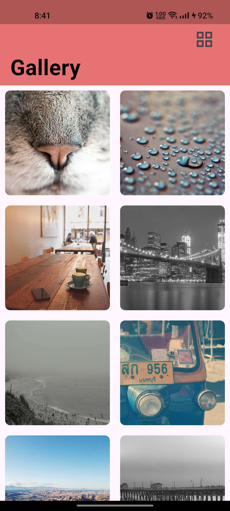
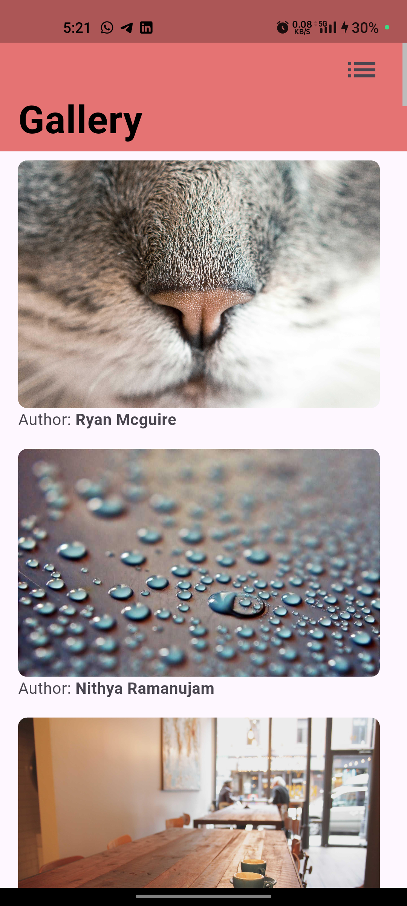

# Flutter Gallery App

This is a Flutter-based gallery app that displays images in a grid view, with zoomable functionality and caching for better performance and infinite scrolling.
 
 

## Features

- Image grid display with pagination.
- Pull-to-refresh functionality.
- Infinite Scrolling.
- Zoomable Image feature with `photo_view` package.
- Image caching using `CachedNetworkImage`.
- State management using `BLoC` pattern.
- Clean code architecture for improved readability and maintainability.
- Show images in a grid or list format.
- Implement loading and error states with appropriate UI feedback.
## Prerequisites

- Flutter SDK installed (https://flutter.dev/docs/get-started/install).
- Android Studio or Visual Studio Code for development.
- Device or emulator for testing.

## Getting Started

### 1. Clone the Repository
```bash
git clone https://github.com/Uday-kiran9147/Imageview.git
cd Imageview
```

### 2. Install Dependencies
```bash
flutter pub get
```

### 3. Run the App
```bash
flutter run
```

